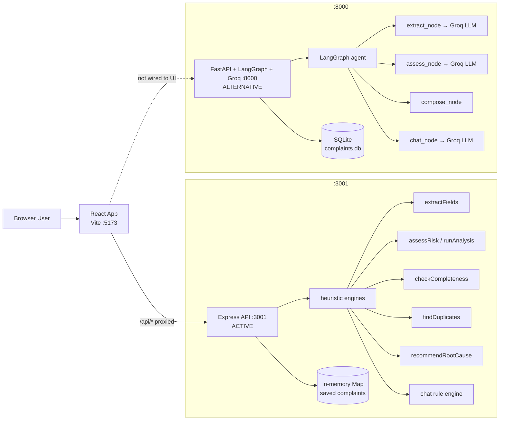
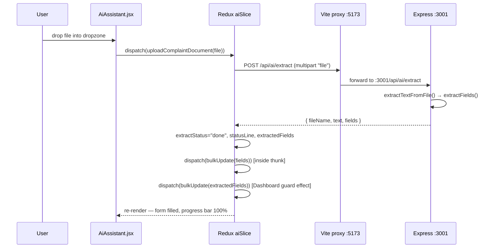

# 1. System Architecture

> [Back to index](README.md)

This document explains how every piece of the system fits together, using component, topology, data-flow, and sequence diagrams.

---

## 1.1 High-level overview

The system has three tiers:

1. **Frontend** — React 18 SPA served by the Vite dev server on port **5173**.
2. **Active backend** — Node.js/Express API on port **3001** that performs REST handling, file upload, and all *heuristic* "AI" work (extraction, risk scoring, analysis, completeness, duplicates, root cause, chat).
3. **Alternative backend** — FastAPI + LangGraph + Groq on port **8000**, an LLM-powered replacement that is fully implemented but **not wired to the frontend**.

The Vite dev server proxies every `/api/*` request to Express, which keeps the browser free of CORS issues during development.

```
            ┌───────────────────────────────────────────────────────────┐
            │                     BROWSER  (:5173)                      │
            │   index.html → main.jsx → App.jsx → Dashboard.jsx         │
            │   React 18 · React Redux · Redux Toolkit · Vite 6 (HMR)  │
            └───────────────────────────────┬───────────────────────────┘
                                            │
                          fetch("/api/...") │  relative URL
                                            ▼
                              ┌─────────────────────────────┐
                              │   VITE DEV SERVER  (:5173)  │
                              │   /api/*  →  :3001  (proxy) │
                              └─────────────────────────────┘
                                            │
                        ┌───────────────────┴───────────────────┐
                        ▼                                       ▼
   ┌───────────────────────────────────┐      ┌──────────────────────────────────────┐
   │   EXPRESS API  (:3001)  ACTIVE    │      │  FASTAPI + LANGGRAPH + GROQ (:8000)   │
   │   · REST routes                   │      │  · LLM extraction / assessment / chat │
   │   · multer file upload            │      │  · SQLAlchemy → SQLite                │
   │   · heuristic engines             │      │  · text_extract (pypdf, python-docx)  │
   │   · in-memory complaints Map      │      │  (NOT wired to the UI)                │
   └───────────────────────────────────┘      └──────────────────────────────────────┘
```

---

## 1.2 Component diagram (Mermaid)



---

## 1.3 Frontend component tree

```
<Provider store>  (main.jsx)
 └─ <App />                       App.jsx
     └─ <Dashboard />             Dashboard.jsx
         ├─ main.columns
         │  ├─ section.col.col--form
         │  │   ├─ <ComplaintForm />          manual intake + save/reset
         │  │   ├─ <ComplaintAnalysis />      summary · risk · CAPA
         │  │   └─ <CompletenessChecker />    QA readiness checklist
         │  └─ section.col.col--ai
         │      ├─ <AiAssistant />            co-pilot chat + upload/paste
         │      ├─ <RootCause />              investigation guidance
         │      └─ <DuplicateDetector />      duplicate flags
         └─ (ambient background orbs)

Shared building blocks
 ├─ fields/FormField.jsx   → TextInput · SelectInput · DateInput · TextArea
 └─ icons/Icons.jsx        → SVG icon set (Sparkle, Bot, Send, Loader, Check, Alert, …)
```

---

## 1.4 Redux state architecture

```
 configureStore (store/index.js)
   │
   ├─ complaint  (complaintSlice.js)
   │    ├─ form          → 11-field complaint object (single source of truth)
   │    ├─ status/error  → save lifecycle (idle | saving | saved | error)
   │    ├─ lastSavedId   → ref of last saved complaint
   │    ├─ list          → complaints from GET /api/complaints
   │    └─ listStatus/listError
   │
   └─ ai  (aiSlice.js)
        ├─ fileName, extractStatus, progress, statusLine, extractedFields
        ├─ chatMessages, chatInput, chatStatus, chatError
        ├─ riskAssessment  (legacy card)
        └─ analysis        (AI Complaint Analysis card)
```

Thunks and the endpoints they call:

```
uploadComplaintDocument(file)        → POST /api/ai/extract      → bulkUpdate(fields)
submitAiMessage({message, context})  → POST /api/ai/chat         → bulkUpdate(extracted)
generateRiskAssessment({form,...})   → POST /api/ai/risk-assessment   (legacy)
generateAiAnalysis({form,...})       → POST /api/ai/analysis
saveComplaint(form)                  → POST /api/complaints
fetchComplaints()                    → GET  /api/complaints
```

---

## 1.5 Data-flow: document upload



```
   User            AiAssistant          aiSlice                Express :3001
     │   drop file     │                    │                       │
     ├────────────────►│  uploadComplaintDocument(file)             │
     │                 ├───────────────────►│   FormData{file}      │
     │                 │                    ├──────────────────────►│  extractTextFromFile
     │                 │                    │                       │      │
     │                 │                    │                       │  extractFields(text)
     │                 │                    │◄──────{fileName,text,fields}│
     │                 │                    │                       │
     │                 │                    │  bulkUpdate(fields)   │
     │                 │◄───────────────────┤  statusLine="Extraction complete — N fields…"
     │   form auto-fills ◄──────────────────┤
```

---

## 1.6 Data-flow: chat message

```
   User            AiAssistant              aiSlice               Express :3001
     │  type msg     │                         │                       │
     ├──────────────►│  addChatMessage(user)   │                       │
     │               │  submitAiMessage({msg, context: {form, extracted}})
     │               ├────────────────────────►│   POST /api/ai/chat   │
     │               │                         ├──────────────────────►│  chat rule engine
     │               │                         │◄────{reply, extracted?}│
     │               │                         │                       │
     │               │                         │  bulkUpdate(extracted)│  (only when the
     │               │                         │  push assistant reply │   message carried
     │   bubble reply ◄────────────────────────┤                       │   complaint data)
```

---

## 1.7 Data-flow: auto-panels (analysis / completeness / duplicates / root cause)

These panels subscribe to the same Redux `complaint.form`. As soon as the form carries any data, they activate:

```
                     ┌────────────────────────────────────────────┐
                     │  complaint.form changes (bulkUpdate / typing)│
                     └───────────────────────┬────────────────────┘
                                             │  (useSelector)
         ┌───────────────┬───────────────────┼───────────────────┬───────────────┐
         ▼               ▼                   ▼                   ▼               ▼
   CompletenessChecker  ComplaintAnalysis  RootCause         DuplicateDetector
   (local util)         (user clicks)      (debounce 500ms)   (debounce 600ms)
   checkCompleteness    generateAiAnalysis POST /api/ai/      POST /api/ai/
   form → score/missing → /api/ai/analysis  root-cause          duplicates
```

---

## 1.8 Express heuristic engine map

```
                              ┌──────────────────────────────┐
                              │        server.js            │
                              │       (single file)         │
                              └──────────────┬───────────────┘
                                             │
     ┌───────────────┬───────────────┬───────┴───────┬──────────────────┬──────────────┐
     ▼               ▼               ▼               ▼                  ▼              ▼
  extractFields   assessRisk     runAnalysis      checkCompleteness  findDuplicates  recommendRootCause
  (regex)        (risk scoring)  (summary/risk/   (6 required fields)(fuzzy match    (keyword map →
                                  CAPA)                             ≥40 pts)          causes+steps)
     │
     ├── extractTextFromFile (per ext)
     │     ├─ .txt → decode buffer
     │     ├─ .pdf → extractPdfText (own parser, zlib)
     │     └─ .docx/.eml → canned sample
     │
     └── chat engine uses extractFields + assessRisk + checkCompleteness
```

---

## 1.9 FastAPI + LangGraph agent map

```
                         START
                           │
                           ▼
                     extract_node        (LLM structured output → JSON; fallback → heuristics)
                           │
          ┌────────────────┴────────────────┐
          │                                 │
   looks like question / no fields     real complaint content
          │                                 │
          ▼                                 ▼
      chat_node                        assess_node      (LLM severity/priority/recommendation;
          │                             │                 fallback → keyword scoring)
          │                             ▼
          │                          compose_node      (human confirmation message)
          │                             │
          └──────────────┬──────────────┘
                         ▼
                        END
```

---

## 1.10 Ports & networking summary

| Purpose | URL | Process |
| --- | --- | --- |
| Frontend dev server | `http://localhost:5173` | Vite (npm run dev) |
| Active API (target of proxy) | `http://localhost:3001` | Express (npm run dev) |
| Alternative API (not wired) | `http://localhost:8000` | uvicorn (`app.main:app`) |
| Browser → API path | `/api/*` | Proxied by Vite to `:3001` |

Health check to confirm the Express backend is running:

```bash
curl http://localhost:3001/api/health
# {"ok":true,"service":"customer-complaint","at":"..."}
```
